# Spring Boot JPA MySQL - Building Rest CRUD API example
"# API-rest-FULL-Tutorials" 

----
Se desarrolló todo el CRUD de los tutoriales con el fin de lograr crear una API REST completa.
La misma fué testeada realizando peticiones desde la herramienta Postman.
A continuación documentamos las capturas con los diferentes resultados obtenidos.

#Alta de tutorial
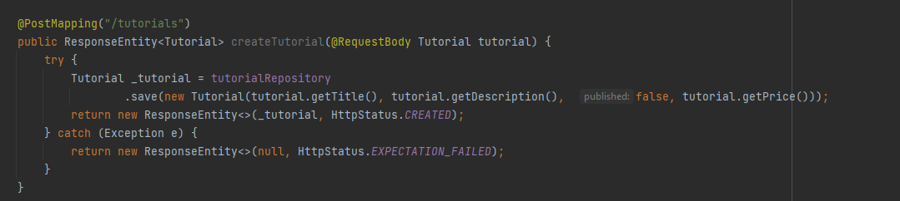
Captura de función para crear un tutorial.

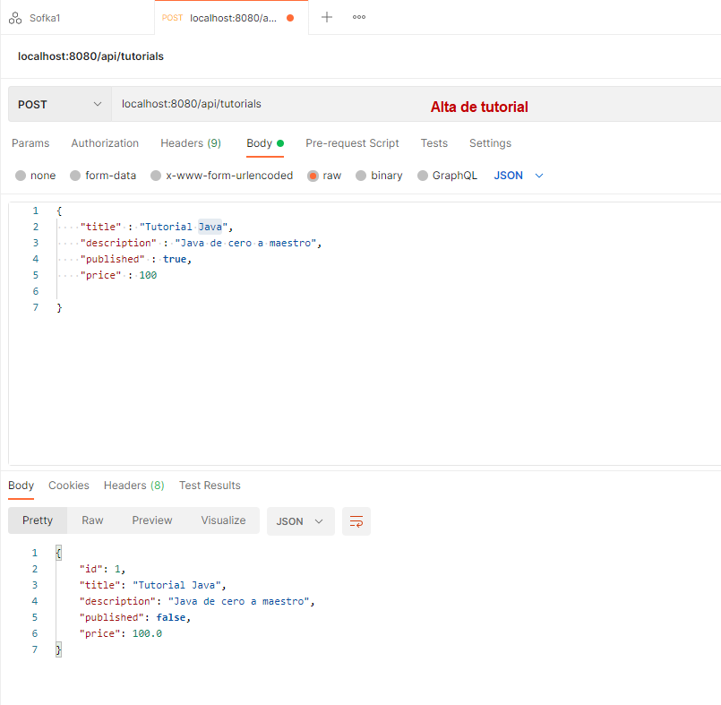
Vista desde Postman con el envío y la respuesta obtenida con el ID generado.

Dando de alta un segundo tutorial
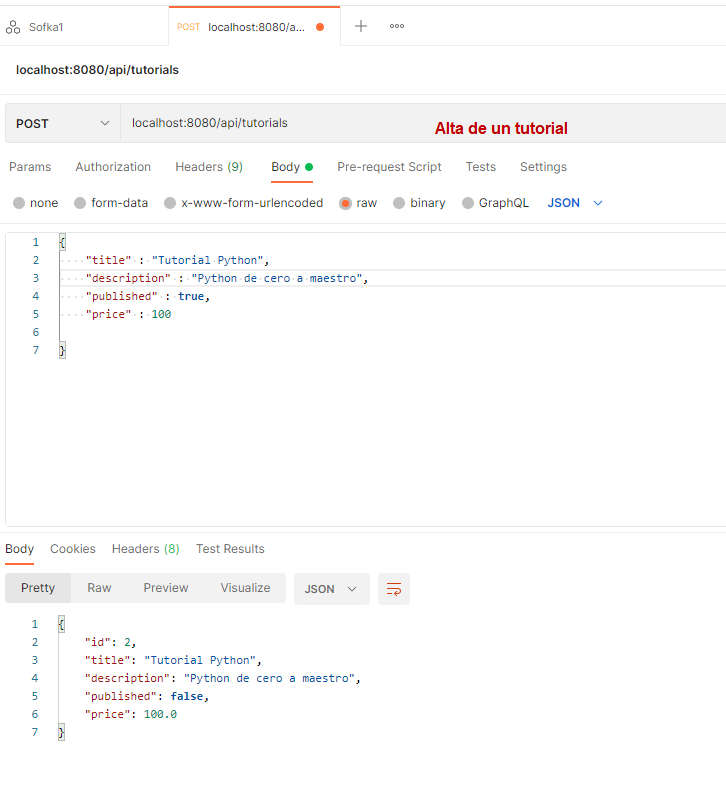

#Lista de todos los tutoriales
Captura de función para listar todos los tutoriales
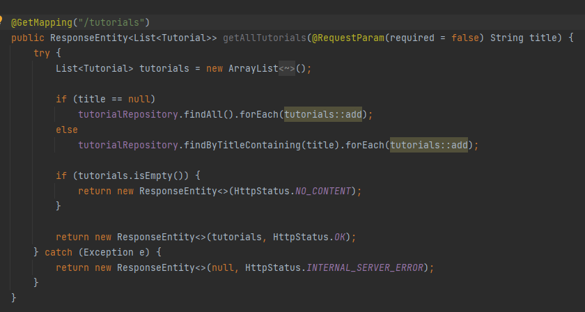

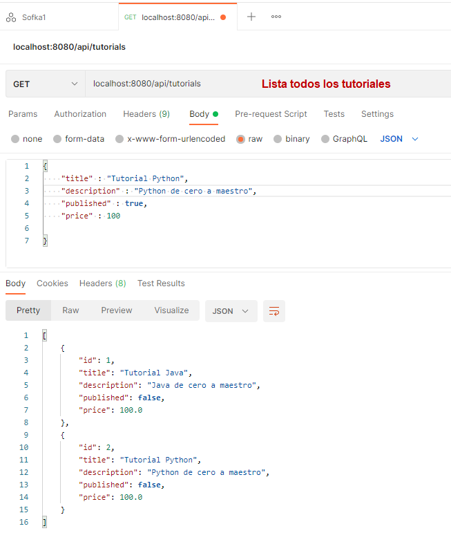

##Consultando tutorial por ID
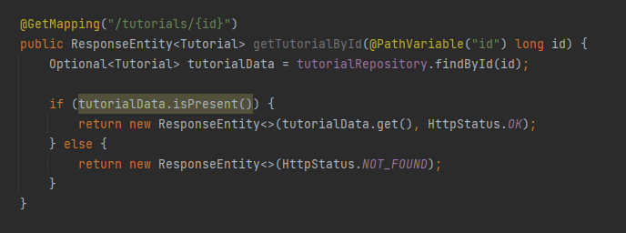

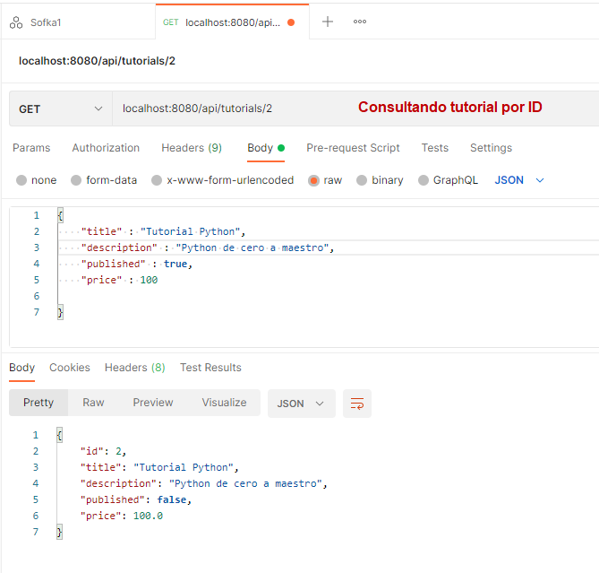

#Actualizando tutorial dado un ID
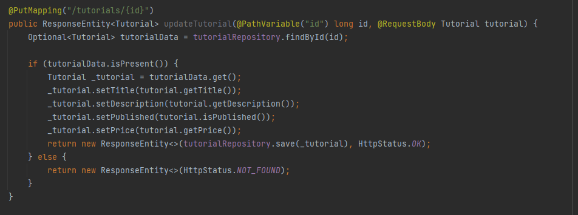

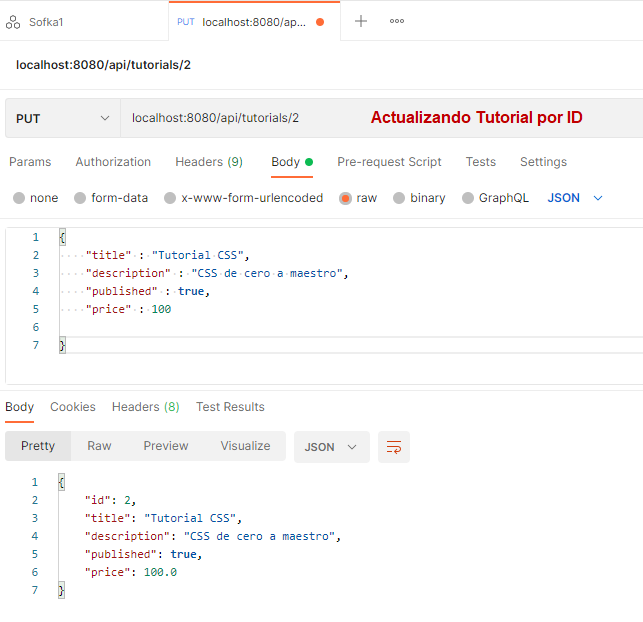

#Función "find-by-price"
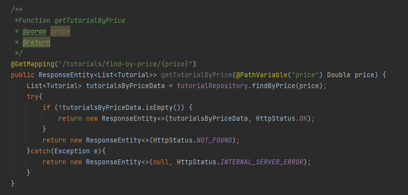
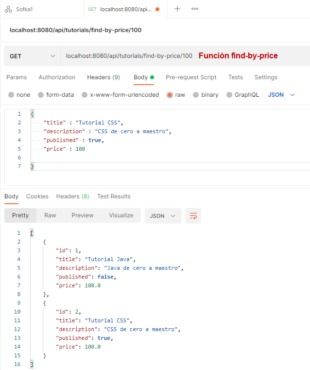